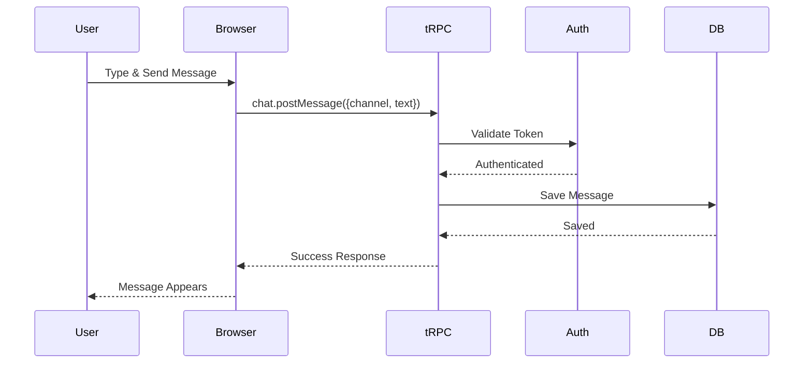

---
targets:
  - '*'
description: ''
---

# DIAGRAM Task

**Persona:** Execute this task as the `@architect` subagent (Archer, Principal Architect 🧠).  
Load the persona characteristics from `.rulesync/subagents/architect.md` before proceeding.

**Required Context:** Review these rules before proceeding:

- `.rulesync/rules/architecture.md` - System architecture patterns
- `.rulesync/rules/database.md` - Database schema and relationships

---

## Task Objective

Analyze code, data structures, or system architecture to generate visual Mermaid diagrams that clearly communicate structure, flow, and relationships.

---

## Task Instructions

1. **Ask discovery questions:**
   1. "What type of diagram should I generate?"
      - a) System Architecture (high-level components and interactions)
      - b) User Flow (user journey through features)
      - c) Sequence Diagram (interaction between components)
      - d) Entity Relationship Diagram (database schema)
      - e) Component Diagram (React component hierarchy)
      - f) State Machine (state transitions)
      - g) Data Flow (data movement through system)
   2. "What should I diagram?"
      - Provide feature name, file path, or system area
   3. "What level of detail?"
      - a) High-level overview
      - b) Detailed with all components
      - c) Focus on specific aspect

2. **Generate System Architecture Diagram:**

   ```mermaid
   graph TB
       subgraph "Client Layer"
           UI[Next.js App Router]
           SC[Server Components]
           CC[Client Components]
       end

       subgraph "API Layer"
           tRPC[tRPC Router]
           OpenAPI[OpenAPI Endpoints]
           Auth[Token Auth]
       end

       subgraph "Business Logic"
           Procedures[tRPC Procedures]
           Validation[Zod Validation]
           RateLimit[Rate Limiting]
       end

       subgraph "Data Layer"
           Prisma[Prisma ORM]
           DB[(SQLite/better-sqlite3)]
       end

       UI --> SC
       UI --> CC
       CC --> tRPC
       SC --> Procedures
       tRPC --> Procedures
       Procedures --> Auth
       Procedures --> Validation
       Procedures --> Prisma
       Prisma --> DB
   ```

3. **Generate User Flow Diagram:**

   ```mermaid
   flowchart TD
       Start([User Opens Shack]) --> Auth{Has Token?}
       Auth -->|No| SignIn[Sign In Page]
       Auth -->|Yes| Workspace[Select Workspace]

       SignIn --> EnterCreds[Enter Email/Password]
       EnterCreds --> GetToken[Receive API Token]
       GetToken --> Workspace

       Workspace --> Channel[Open Channel]
       Channel --> ViewMessages[View Messages]

       ViewMessages --> TypeMessage[Type Message]
       TypeMessage --> SendMessage[Press Enter]
       SendMessage --> Process{Processing}

       Process -->|Success| Broadcast[Broadcast]
       Process -->|Error| Error[Show Error]

       Broadcast --> UpdateUI[Message Appears]
       UpdateUI --> End([Complete])
       Error --> TypeMessage
   ```

4. **Generate Sequence Diagram:**

   ```mermaid
   sequenceDiagram
       participant User
       participant Browser
       participant tRPC
       participant Auth
       participant Prisma
       participant DB

       User->>Browser: Click "Send Message"
       Browser->>tRPC: chat.postMessage(channel, text)

       tRPC->>Auth: Validate token
       Auth-->>tRPC: User authenticated

       tRPC->>Prisma: Check channel membership
       Prisma->>DB: SELECT conversation_member
       DB-->>Prisma: User is member
       Prisma-->>tRPC: Access granted

       tRPC->>Prisma: Create message
       Prisma->>DB: INSERT message
       DB-->>Prisma: Message created
       Prisma-->>tRPC: Message data

       tRPC-->>Browser: {ok: true, message}
       Browser-->>User: Message appears in channel
   ```

5. **Generate Entity Relationship Diagram (ERD):**

   Analyze Prisma schema and generate ERD:

   ```mermaid
   erDiagram
       User ||--o{ TeamMember : "belongs to teams"
       User ||--o{ ConversationMember : "member of conversations"
       User ||--o{ Message : "sends messages"
       User ||--o{ Reaction : "reacts with"
       User ||--o{ ApiToken : "has tokens"

       Team ||--o{ TeamMember : "has members"
       Team ||--o{ Conversation : "owns conversations"

       Conversation ||--o{ ConversationMember : "has members"
       Conversation ||--o{ Message : "contains messages"
       Conversation ||--o{ Pin : "has pins"

       Message ||--o{ Reaction : "has reactions"
       Message ||--o{ Message : "has replies (threads)"
       Message ||--o{ Pin : "can be pinned"

       User {
           string id PK
           string email UK
           string username UK
           string display_name
           string status
           boolean deleted
           datetime created_at
       }

       Team {
           string id PK
           string name
           string slug UK
           string domain
           datetime created_at
       }

       Conversation {
           string id PK
           string name
           string context_team_id FK
           boolean is_channel
           boolean is_private
           boolean is_archived
           int created
           datetime created_at
       }

       Message {
           string id PK
           string conversation_id FK
           string user_id FK
           string content
           string parent_message_id FK
           datetime created_at
       }

       ApiToken {
           string id PK
           string token UK
           string user_id FK
           datetime expires_at
           datetime created_at
       }
   ```

6. **Generate Component Diagram:**

   For React component hierarchies:

   ```mermaid
   graph TD
       App[App Layout]
       App --> Workspace[Workspace Page]
       App --> Channel[Channel Page]

       Workspace --> ClientNav[Client Navigation]
       Workspace --> TeamInfo[Team Info Header]

       Channel --> Header[Channel Header]
       Channel --> MessageList[Message List]
       Channel --> MessageInput[Message Input]

       MessageList --> Message[Message Component]
       Message --> Avatar[Avatar]
       Message --> MessageContent[Message Content]
       Message --> MessageReaction[Reactions]
       Message --> MessageActions[Message Actions]

       MessageInput --> RichTextEditor[TipTap Editor]
       MessageInput --> SendButton[Send Button]

       style App fill:#e1f5ff
       style Workspace fill:#fff4e6
       style Channel fill:#fff4e6
       style MessageList fill:#f0f9ff
   ```

7. **Generate State Machine Diagram:**

   For state transitions:

   ```mermaid
   stateDiagram-v2
       [*] --> Idle
       Idle --> Typing: User types
       Typing --> Idle: 3s timeout
       Typing --> Sending: Press Enter
       Sending --> Sent: Success
       Sending --> Failed: Error
       Failed --> Idle: Retry
       Sent --> Idle: Ready for next
       Idle --> [*]: User leaves
   ```

8. **Generate Data Flow Diagram:**

   ```mermaid
   flowchart LR
       User[User Input] --> Form[Message Input]
       Form --> Validation[Zod Validation]
       Validation -->|Valid| tRPC[tRPC Procedure]
       Validation -->|Invalid| Error[Error State]

       tRPC --> Auth[Token Check]
       Auth -->|Pass| BL[Business Logic]
       Auth -->|Fail| Unauthorized[401]

       BL --> DB[Save to SQLite]
       BL --> Log[Console Log]

       DB --> Result[Result]
       Result --> UI[Update UI]

       style User fill:#e3f2fd
       style Form fill:#f3e5f5
       style tRPC fill:#e8f5e9
       style Result fill:#fff3e0
   ```

9. **Save and document:**

   Create directory if needed: `/docs/diagrams/`

   Save diagram to: `/docs/diagrams/{name}.md`

   Include:

   ````markdown
   # {Diagram Title}

   **Type:** {Architecture | Flow | Sequence | ERD | Component | State | Data Flow}  
   **Created:** {date}  
   **Scope:** {what this diagrams}

   ## Diagram

   ```mermaid
   {generated diagram}
   ```

   ## Description

   {Explain what the diagram shows}

   ## Key Components

   - **{Component}:** {Description}
   - **{Component}:** {Description}

   ## Notes

   {Any important context or caveats}

   ## Related Documentation

   - {Link to related spec/brief/docs}
   ````

10. **Provide summary:**
    - Show preview of diagram
    - Explain key components
    - Suggest where to use this diagram (specs, docs, PRs)
    - Ask if updates needed

---

## Notes

- 🎨 Use Mermaid syntax (renders in GitHub, GitLab, many docs tools)
- 📊 Keep diagrams focused - split complex systems into multiple diagrams
- 🎯 Choose the right diagram type for what you're communicating
- 🏷️ Use clear labels and legends
- 🔄 Update diagrams when code changes
- 📝 Include diagrams in technical specifications

---

## Diagram Types Guide

**Use System Architecture when:**

- Explaining high-level system design
- Onboarding new developers
- Planning major changes

**Use User Flow when:**

- Documenting user journeys
- Planning UX improvements
- E2E test planning

**Use Sequence Diagram when:**

- Explaining complex interactions
- Debugging integration issues
- Documenting API workflows

**Use ERD when:**

- Documenting database schema
- Planning migrations
- Understanding data relationships

**Use Component Diagram when:**

- Documenting React structure
- Planning component refactoring
- Understanding UI hierarchy

**Use State Machine when:**

- Documenting state transitions
- Planning feature states
- Understanding complex workflows

**Use Data Flow when:**

- Documenting data movement
- Understanding transformations
- Planning data pipelines

---

## Example Output

````markdown
## 📊 Diagram Generated

### Type: Sequence Diagram

### Subject: Real-Time Message Delivery Flow

**File:** `/docs/diagrams/message-delivery-flow.md`

**Diagram Shows:**

- User sends message via tRPC
- Token authentication
- Database persistence
- UI update

**Key Insights:**

- 5 steps in happy path
- 2 potential failure points (auth, channel membership)
- Message persisted to database after validation

**Suggested Use:**

- Add to Messaging Technical Spec
- Reference in API documentation
- Use in developer onboarding
- Include in E2E test planning

**Preview:**


````

```

```
